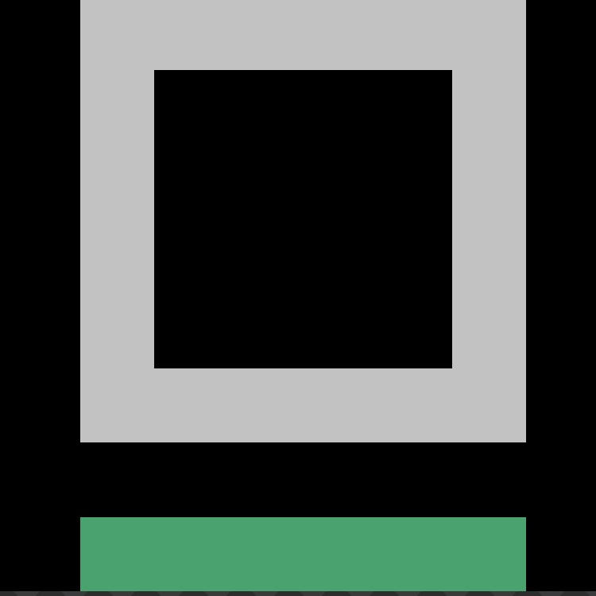

# 🏠 Open-code-Studio

**Open-code-Studio** 是一个致力于开发高质量开源软件的组织。我们专注于构建实用、优雅、跨平台的工具和应用，以提升开发者和用户的日常体验。

---

## 🌟 我们的理念

- **开放透明**：所有项目源代码在 GitHub 上完全公开，遵循开源许可证
- **社区驱动**：欢迎来自全球的开发者参与贡献，共同改进项目
- **质量优先**：注重代码质量、文档完善和用户体验
- **跨平台支持**：项目尽可能覆盖 Windows、macOS、Linux 等主流平台

---

## 🚀 快速导航

| 项目 | 简介 | 状态 |
|------|------|------|
| [**JMCL**](https://github.com/Open-code-Studio/JMCL) | 开源、跨平台的 Minecraft 启动器 | 🚧 开发中 |
| 更多项目 | 敬请期待... | 📋 规划中 |

---

## 📚 文档

- [JMCL 文档站](JMCL/page/index.html) — 查看 JMCL 启动器的完整文档
- [贡献指南](#/contributing) — 了解如何为我们的项目做贡献
- [加入我们](#/join) — 成为 Open-code-Studio 的一员

---

## 💡 技术栈

我们主要使用以下技术栈：

- **桌面应用**：Kotlin/Compose Multiplatform
- **前端**：HTML5 + CSS3 + Vanilla JavaScript
- **后端**：Kotlin (JVM)、Node.js
- **构建工具**：Gradle、Vite
- **CI/CD**：GitHub Actions

请随时浏览我们的 [GitHub 组织](https://github.com/Open-code-Studio) 了解更多。
